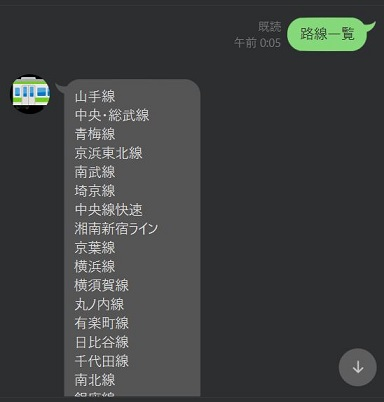
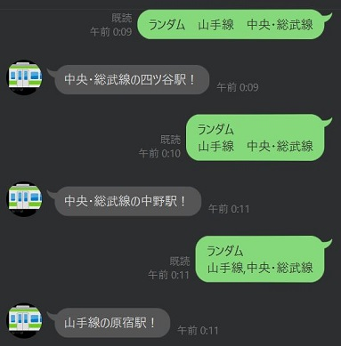
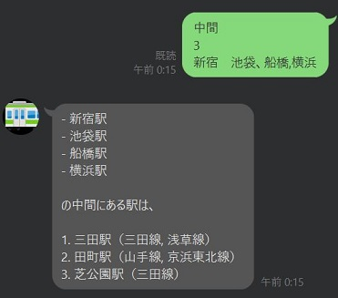

# LINE Bot
コロナが発生してから在宅勤務になり、基本的な行動範囲は家の中になった。  
先日大学時代の友達に会ったが、みんな同じような状況で、運動不足だと言っていた。  
せっかくなので、その日は日暮里駅から東京駅まで、山手線沿いに歩いた。  

複数人で歩くと、色々な話ができる上、一人では歩かない距離と時間を歩くことができる。  
コロナで減少した、運動とコミュニケーションが同時に補えることになる。  
そうだ、「歩こう会」を行えばいいんだ、と思った。  

そこで問題になるのは、集合場所だ。  
複数人で「ここはどうだ、あそこはどうだ」とやるとまとめるのに苦労するし、  
みんな住んでいるところが違うので、平等に決めるのも難しい。  

ということで、集合場所を決めてくれるLINE Botを作ることにした。

# データ
路線・駅のデータは[駅データ.jp](http://www.ekidata.jp/)からダウンロードして使っています。  
`データダウンロード`から`路線データ`と`駅データ`をダウンロードしてください。  
- 路線データ：e.g. `line20200619free.csv`
- 駅データ： e.g. `station20200619free.csv`

各都道府県にどの路線が通っているかは、[Yahoo!路線情報](https://transit.yahoo.co.jp/station/top)が見やすいです。

# 準備
## LINE DevelopersとHerokuの登録・設定
以下のサイトを参考にしました。
- [Python + HerokuでLINE BOTを作ってみた](https://qiita.com/shimajiri/items/cf7ccf69d184fdb2fb26#flask%E3%81%A8line-bot-sdk%E3%82%92%E3%82%A4%E3%83%B3%E3%82%B9%E3%83%88%E3%83%BC%E3%83%AB)
- [HerokuにRailsアプリをデプロイする手順](https://qiita.com/NaokiIshimura/items/eee473675d624a17310f)
- [PythonでLine botを作ってみた](https://qiita.com/kro/items/67f7510b36945eb9689b)
- [Heroku操作 CLI](https://qiita.com/ntkgcj/items/9e812220881d671b6bff)

## データの変換
1. `tools`配下に上で取得した`路線データ`と`駅データ`を置きます。

2. `tools/config.json`で使用する路線を指定します。  
    デフォルトでは東京都を通る路線の大体が入っています。
    - keyは`路線データ`の路線名と対応するようにしてください。
    - valueで実際に使用する名前を指定します。

3. `路線データ`と`駅データ`から必要な情報を抜き出します。  
    抜き出す情報は、`tools/config.json`に対応します。
    ```
    python convert_csv2json.py -l <路線データ> -s <駅データ>
    ```
    出力は、
    - `line_stations.json`：路線と駅の対応
    - `station_lon_lat.json`：駅と緯度・経度の対応

4. Herokuにpushします。

# 使い方
1. 登録されている路線の一覧を表示します
    ```
    路線一覧
    ```
    

1. 指定した路線から適当に駅を表示します
    ```
    ランダム　<路線名>　...
    ```
    

1. 指定した駅の中間地点を表示します
    ```
    中間　<数字>　<駅名>　...
    ```
    